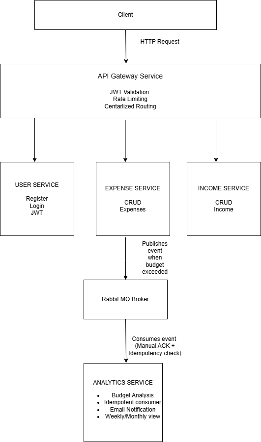

# Distributed Finance Tracker

A production-grade microservice ecosystem for personal finance management - track income, expenses and receive real-time budget alerts
when monthly spending limits are exceeded.

Build with a focus on reliability, decoupled communication, and data consistency across distributed services.

## Services
- api-gateway-service : Centralized routing, JWT authentication
- user-service : Registration, login, token issuance 
- expense-service : Expense CRUD, triggers budget events
- income-service : Income CRUD operations
- analytics-service : Budget Analysis, RabbitMQ consumer, notifications

## Key Technical Decisions
- Event-driven architecture using RabbitMQ with manual acknowledgement and prefetch configuration for guaranteed message delivery.
- Idempotent consumer pattern in Analytics Service prevents duplicate notification processing during message redelivery
- JWT-based authentication enforced at the API-Gateway downstream services trust the gateway.
- Eureka Service discovery for dynamic inter-service communication via OpenFeign
- Separate MySQL database per service maintaining data isolation.

## Tech stack
In this project i used following tech stacks
1. Programming language : Java
2. Framework : Spring Boot 4.x
3. Security : Spring Security + JWT
4. Messaging Broker: RabbitMQ(AMQP) (for decoupled, event-driven notification service)
5. Database : MySQL + Spring Data JPA
6. Service Discovery : Netflix Eureka
7. Containerization : Docker + Docker compose
8. CI/CD : GitHub Actions

## Getting Started
### Prerequisites 
* JDK 17 or higher
* RabbitMQ server (running locally or via Docker)
* Maven

## System Architecture
()

### Installation

```bash
   # 1. Clone the repository
   git clone https://github.com/sanjeevamsi/distributed-financial-tracker.git
   
   #2. Navigate into the project
   cd distributed-financial-tracker
   
   #3. Build all services
   mvn clean package -DskipTests
   
   #4. Start all the services with Docker compose
   docker-compose up --build
```
